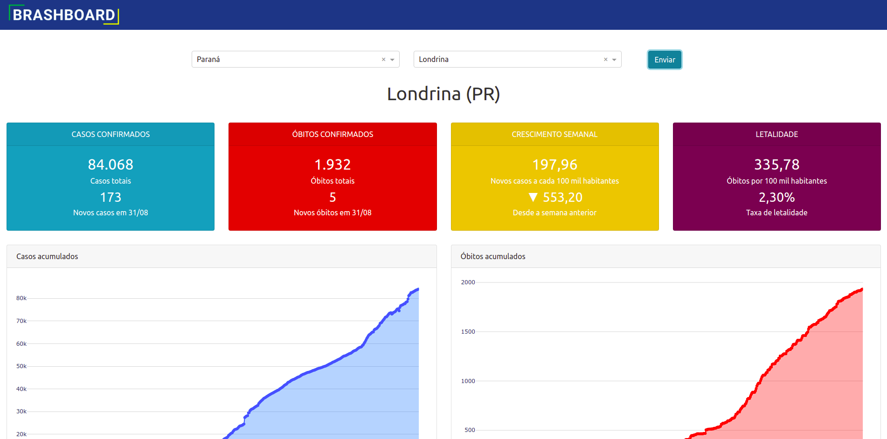

<!-- PROJECT LOGO -->
 

  

  

    COVID-19 situation in brazilian cities
  

## About The Project

Finding information about the COVID-19 pandemic at the city level was not always an easy task, since many cities did not provide an easily accessible way of keeping track of daily numbers from the pandemic. Thanks to the folks from [brasil.io](https://brasil.io), that compiled data from every state secretary of health, it was possible to develop this dashboard, that provides pandemic evolution data from national, state and city level in an easy and intuitive way.

### Built With

* [Plotly Dash](https://dash.plotly.com/)
* [AWS Elastic Beanstalk](https://aws.amazon.com/elasticbeanstalk/)